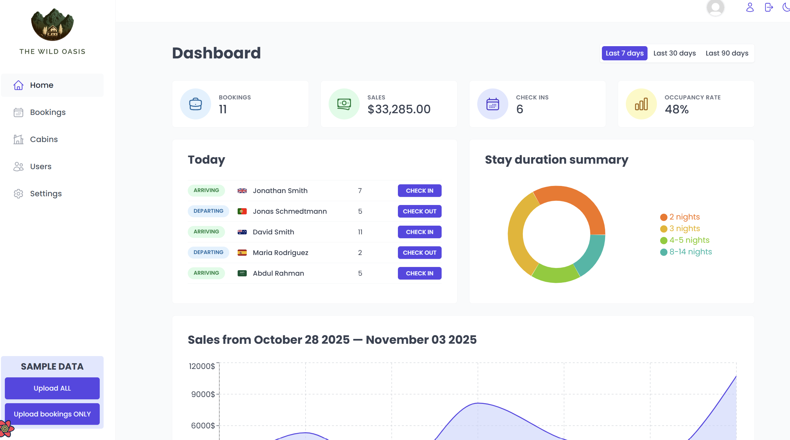
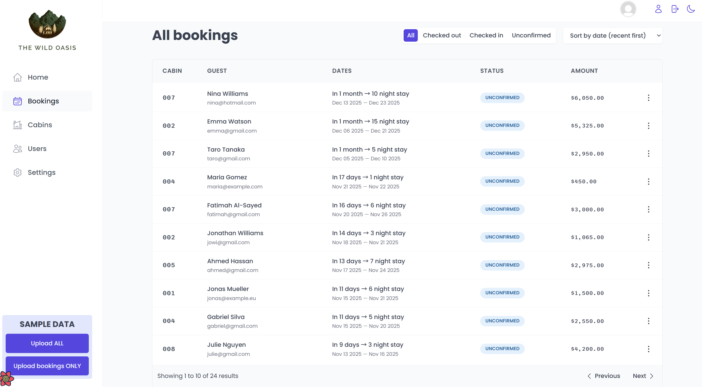

## 快速概览 — 度假村管理系统

- 单页 React 应用，由 Vite 驱动（入口：`src/main.jsx`，根组件：`src/App.jsx`）。
- 数据层使用 Supabase（数据库 + Auth + Storage），客户端缓存和请求管理使用 React Query（`@tanstack/react-query`）。
- 路由使用 `react-router-dom`；受保护路由由 `src/ui/ProtectedRoute.jsx` 控制。

## 立即能做的开发/运行命令

- 安装依赖：`npm install`
- 启动开发服务器（Windows PowerShell）：
  ```powershell
  npm run dev
  ```
- 构建：`npm run build`
- 本地预览：`npm run preview`
- Lint：`npm run lint`（项目包含 `.eslintrc.*`）

## 关键架构与约定

- Supabase 客户端在 `src/services/supabase.js`：当前仓库将 key & url 写明在此文件（生产改动请改用环境变量）。
- Storage buckets：`avatars`（用户头像）、`cabin-images`（小屋图片）。上传/下载逻辑见 `src/services/apiAuth.js` 与 `src/services/apiCabins.js`。
- React Query 约定：queryKey 以数组形式包含 filter/sort/page 等（示例：`["bookings", filter, sortBy, page]`）。修改数据、预取（prefetch）或更改 key 时要保持一致，以免缓存失效或重复请求。参见 `src/features/bookings/useBookings.js`。
- URL 驱动列表状态：筛选/排序/分页通过 `useSearchParams` 同步到 URL（示例参数：`?page=2&sortBy=startDate-desc&status=checked-in`）。UI 组件和 hooks 依赖此约定。

## 主要功能与对应文件/技术

- 用户认证（signup/login/logout/update）：`src/features/authentication/*`，接口位于 `src/services/apiAuth.js`。用到 Supabase Auth、react-hook-form、Supabase Storage（头像）。
- 预订管理（Bookings）：列表、分页、筛选、排序、详情、更新、删除。hook：`src/features/bookings/useBookings.js`，接口：`src/services/apiBookings.js`。技术：React Query、date-fns、Supabase。
- 小屋管理（Cabins）：CRUD 与图片上传。文件：`src/features/cabins/*`，接口：`src/services/apiCabins.js`（注意上传先到 Storage 再写 DB）。
- 仪表盘（Dashboard）：图表与统计，数据来源为 `apiBookings.getBookingsAfterDate` / `getStaysAfterDate` / `getStaysTodayActivity`，图表库使用 `recharts`。
- 设置（Settings）：`src/services/apiSettings.js` + `src/features/settings/*`，单行设置表（id=1）。
- 全局样式与暗色主题：`src/styles/GlobalStyles.js` 与 `src/context/DarkModeContext.jsx`（localStorage 存偏好，class 切换 `.dark-mode`/`.light-mode`）。
- UI 组件模式：大量使用 `styled-components`，组件常以组合子组件方式导出（例如 `Menus` 有 `Menus.Toggle/Menus.List/Menus.Button`）。

## BUG与注意点

- `src/services/supabase.js` 明文 key：不要在 PR 中将生产 key 明文入库；改动时尽量使用 `process.env`。
- React Query key 必须一致：更新过滤或分页逻辑时同步更新 `queryKey` 的构造。prefetch 逻辑假设 page 数字连续。
- `Menus.jsx` 的外部点击与 toggle 的事件阶段（捕获/冒泡）存在交互细节：`useOutsideClick` 默认为捕获阶段，某些点击会“先触发关闭再触发打开”的现象（实现时请查看 `src/ui/Menus.jsx` 中注释）。
- 图片上传流程：先生成文件名并上传到 Storage，再写入表。如果上传失败，调用方应回滚或抛错（参见 `createEditCabin`）。

## 可参考的关键文件

- 路由与 QueryClient：`src/App.jsx`
- 入口与 ErrorBoundary：`src/main.jsx`、`src/ui/ErrorFallback.jsx`
- Supabase 客户端：`src/services/supabase.js`
- Bookings 接口：`src/services/apiBookings.js`
- Cabins 上传逻辑：`src/services/apiCabins.js`
- Bookings 列表 hook（URL-driven + prefetch）：`src/features/bookings/useBookings.js`
- UI 组件示例（portal + outside click）：`src/ui/Menus.jsx`
- 全局样式：`src/styles/GlobalStyles.js`

## 其他

- 修改后端相关代码（supabase queries/storage）时，请同时确认前端调用方的 error handling 与 loading 状态；优先保持现有 `queryKey` 约定。
- 更改分页/过滤 URL 参数时：更新 `useSearchParams` 的解析逻辑、测试预取行为，并在必要时调整 Pagination 组件。
- 若需要新增 long-running 操作（如大文件上传），考虑把上传进度与错误回滚逻辑显式化并在 UI 显示。

---

## 部分页面展示




